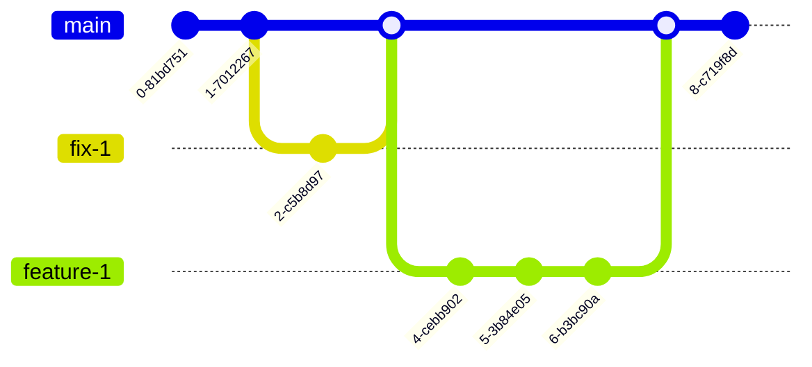

# semantic-basic

Basic semantic-release environment

# Branching strategy

Branching strategy is [Trunk Based Development](https://trunkbaseddevelopment.com/):

Notes:

- Use squash and merge strategy (all commits from child branch are squashed into single one) for feature and fix branches to merge into upstream (or trunk, or main)
