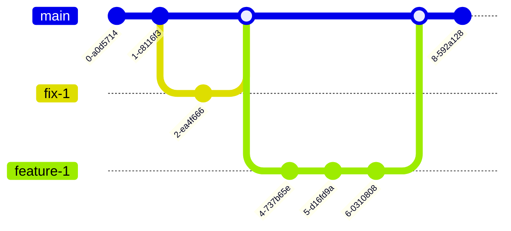
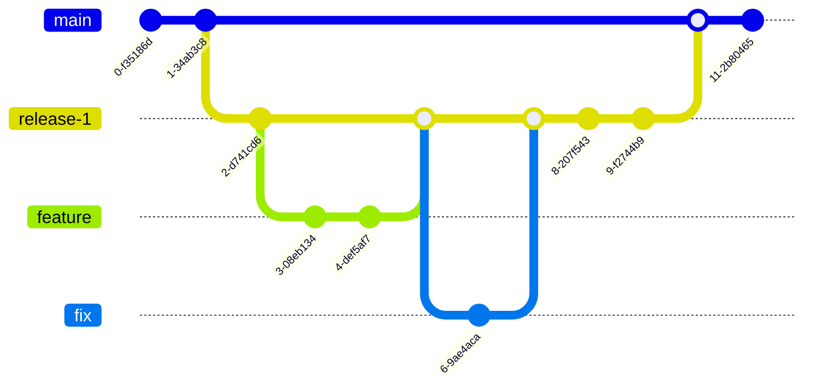

# semantic-basic

Basic semantic-release environment

# Branching strategy

The most applicable branching strategy is [Trunk Based Development](https://trunkbaseddevelopment.com/).

Simple:

With [short-lived feature branches](https://trunkbaseddevelopment.com/short-lived-feature-branches/):

Notes:

- Use squash and merge strategy (all commits from child branch are squashed into single one) for feature and fix branches to merge into release branch
- Use rebase and merge strategy (all commits from release branch are moved to upstream branch) for release branches
